# 情绪管理系统详细设计说明书

**文档编号**：DDS-MoodBloom-2026-001  
**版本号**：V1.0  
**编制日期**：2026年6月28日  
**密级**：公开  

---

## 1. 引言

### 1.1 编写目的

本详细设计说明书旨在深入描述MoodBloom情绪管理系统的每个模块的内部实现机制、算法逻辑、数据结构和接口细节，为开发人员提供直接的编码指导。本文档遵循GB/T 8567-2006《计算机软件文档编制规范》附录A的要求编制。

### 1.2 文档结构

| 章节 | 内容 |
|------|------|
| 2. 模块详细设计 | 各页面组件的类图、流程图、序列图 |
| 3. 关键算法设计 | 5个洞察卡片的完整算法实现 |
| 4. 数据结构设计 | localStorage数据结构详解 |
| 5. 接口详细说明 | 组件间交互、数据存取接口 |
| 6. 异常处理设计 | 边界情况和错误处理 |

---

## 2. 模块详细设计

### 2.1 全局布局模块 (App.jsx)

#### 2.1.1 组件类图

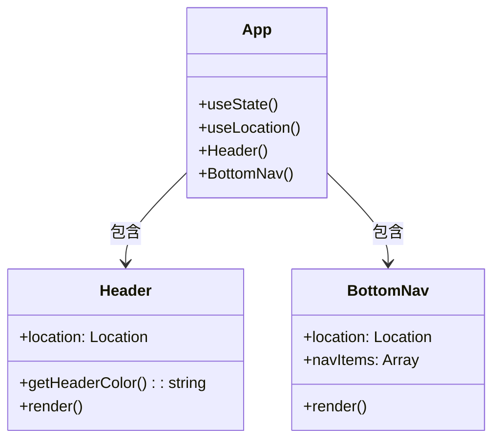

#### 2.1.2 页面主题切换逻辑

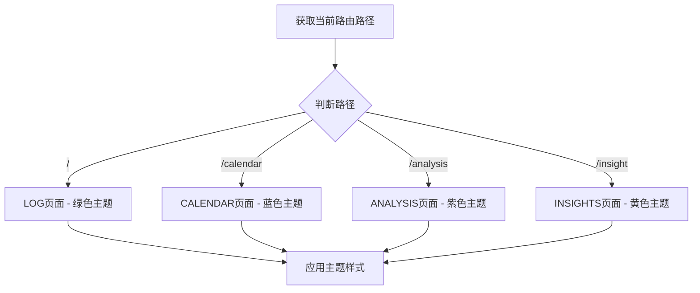

#### 2.1.3 底部导航组件结构

| 属性 | 类型 | 值 |
|------|------|------|
| icon | String | 📝 / 📅 / 📊 / 💡 |
| label | String | 记录 / 日历 / 分析 / 洞察 |
| path | String | / / /calendar / /analysis / /insight |
| color | String | 对应页面主题色 |

---

### 2.2 情绪记录模块 (Record.jsx)

#### 2.2.1 组件类图

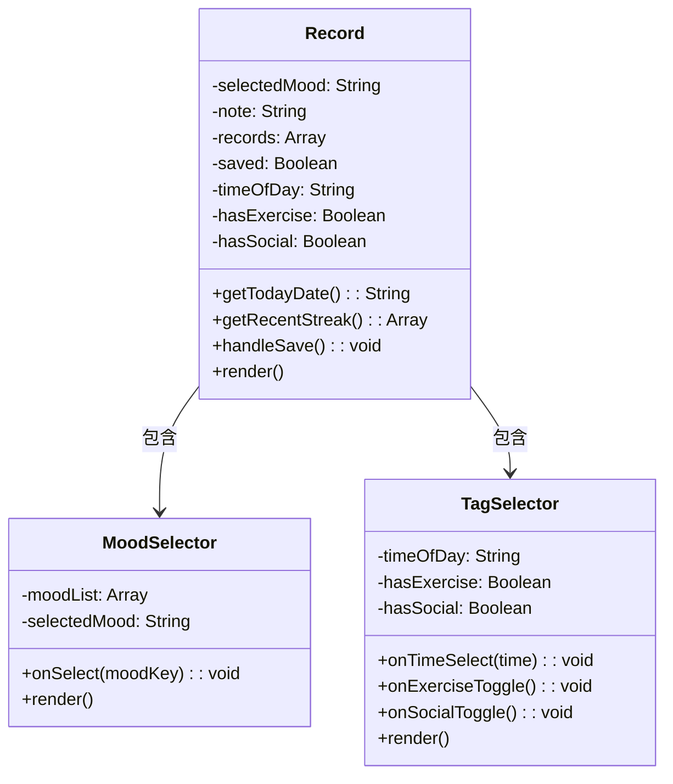

#### 2.2.2 时段自动判断流程图

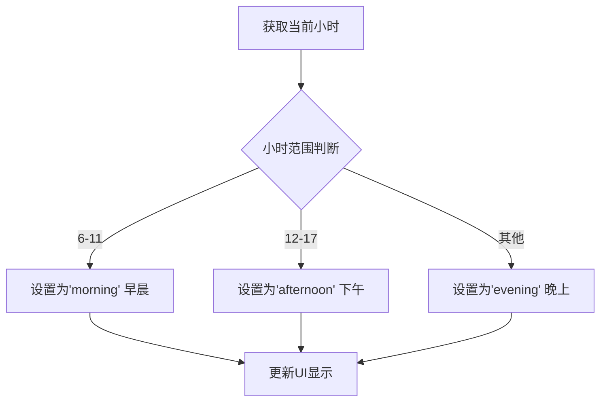

#### 2.2.3 保存操作序列图

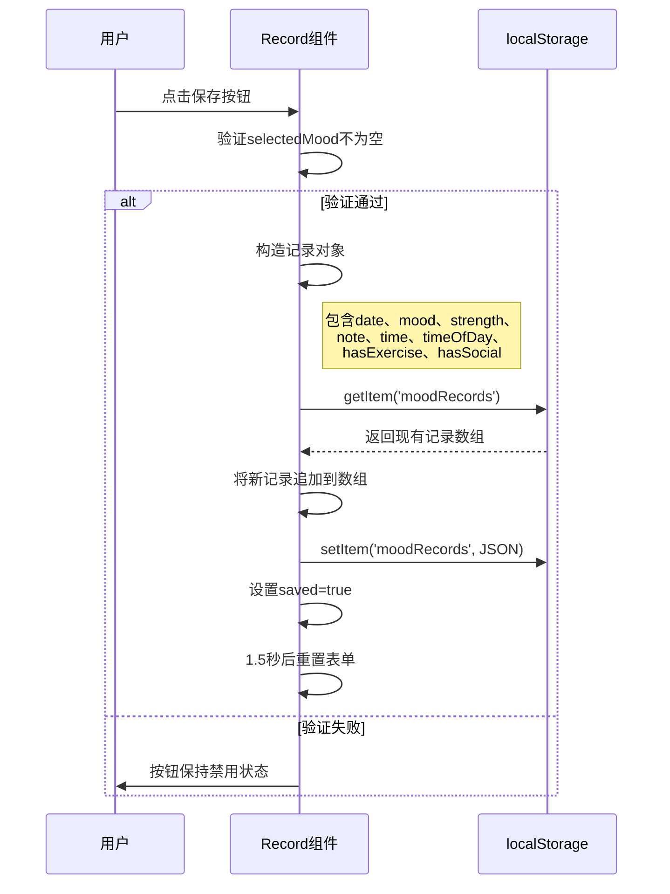

#### 2.2.4 保存函数伪代码

```javascript
/**
 * 保存情绪记录到localStorage
 * @returns {void}
 */
function handleSave() {
    if (!selectedMood) return
    
    // 根据情绪key获取完整的情绪对象
    const moodData = moodList.find(m => m.key === selectedMood)
    
    // 构造记录对象
    const record = {
        date: new Date().toLocaleDateString(),      // 当前日期字符串
        mood: moodData,                             // 完整情绪对象
        strength: calculateStrength(selectedMood),  // 计算情绪分值
        note: note,                                 // 用户备注
        time: Date.now(),                           // Unix时间戳
        timeOfDay: timeOfDay,                       // 时段标签
        hasExercise: hasExercise,                   // 运动标记
        hasSocial: hasSocial                        // 社交标记
    }
    
    // 读取现有记录
    const oldRecords = JSON.parse(localStorage.getItem('moodRecords') || '[]')
    
    // 追加新记录
    oldRecords.push(record)
    
    // 保存回localStorage
    localStorage.setItem('moodRecords', JSON.stringify(oldRecords))
    
    // UI反馈
    setSaved(true)
    
    // 1.5秒后重置表单
    setTimeout(() => {
        setSaved(false)
        resetForm()
        refreshRecords()
    }, 1500)
}

/**
 * 根据情绪key计算分值
 * @param {String} moodKey - 情绪标识
 * @returns {Number} - 分值(1-5)
 */
function calculateStrength(moodKey) {
    const scoreMap = {
        elated: 5,
        good: 4,
        neutral: 3,
        low: 2,
        rough: 1
    }
    return scoreMap[moodKey] || 3
}

/**
 * 重置表单状态
 */
function resetForm() {
    setSelectedMood(null)
    setNote('')
    setHasExercise(false)
    setHasSocial(false)
    
    // 重新计算时段
    const hour = new Date().getHours()
    if (hour >= 6 && hour < 12) setTimeOfDay('morning')
    else if (hour >= 12 && hour < 18) setTimeOfDay('afternoon')
    else setTimeOfDay('evening')
}
```

---

### 2.3 日历模块 (Calendar.jsx)

#### 2.3.1 组件类图

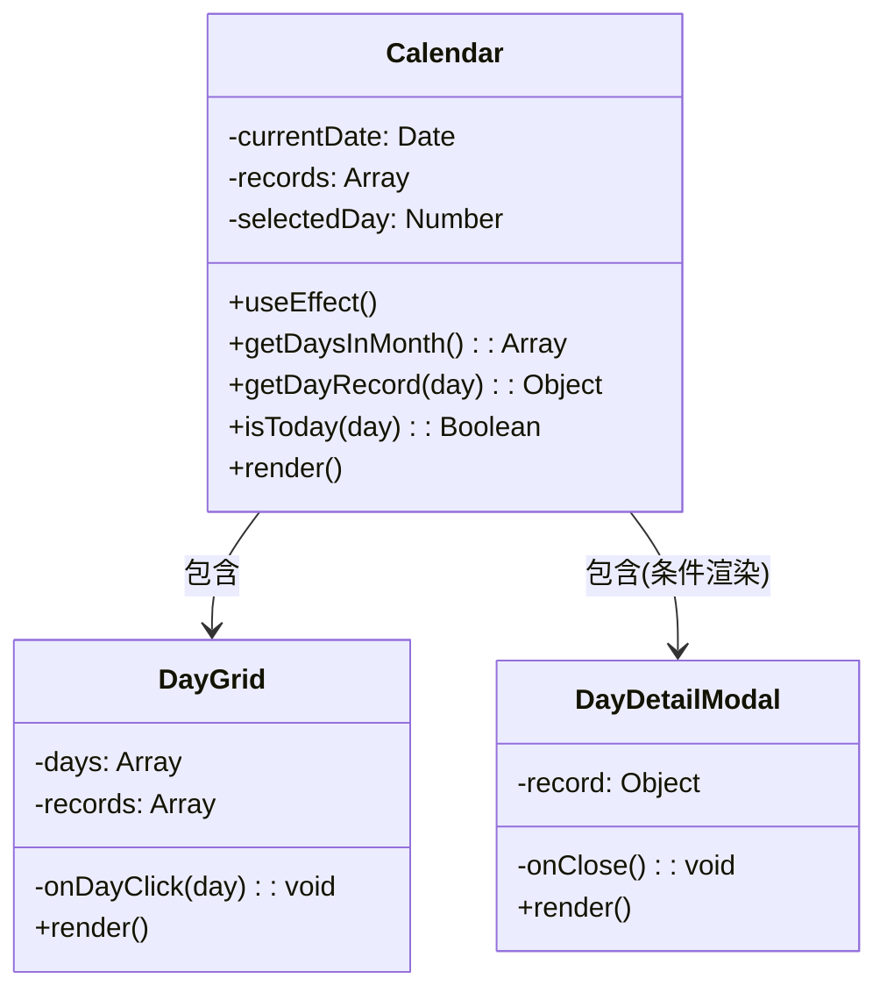

#### 2.3.2 月份渲染流程图

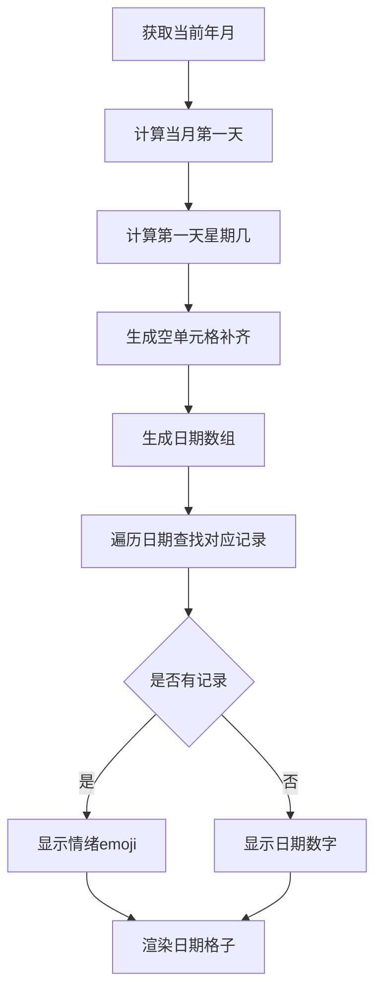

#### 2.3.3 日期匹配算法伪代码

```javascript
/**
 * 根据日期查找记录
 * @param {Number} day - 日期(1-31)
 * @returns {Object|null} - 记录对象或null
 */
function getDayRecord(day) {
    const year = currentDate.getFullYear()
    const month = currentDate.getMonth()
    
    // 构造日期字符串，格式与保存时一致
    const targetDate = new Date(year, month, day)
    const targetDateStr = targetDate.toLocaleDateString()
    
    // 在记录数组中查找匹配日期
    return records.find(record => record.date === targetDateStr)
}

/**
 * 判断是否为今天
 * @param {Number} day - 日期(1-31)
 * @returns {Boolean}
 */
function isToday(day) {
    const today = new Date()
    const year = currentDate.getFullYear()
    const month = currentDate.getMonth()
    
    return (
        year === today.getFullYear() &&
        month === today.getMonth() &&
        day === today.getDate()
    )
}

/**
 * 生成当月日期数组
 * @returns {Array} - 日期数组，空位置为null
 */
function getDaysInMonth() {
    const year = currentDate.getFullYear()
    const month = currentDate.getMonth()
    
    const firstDay = new Date(year, month, 1)
    const lastDay = new Date(year, month + 1, 0)
    
    const days = []
    const startDay = firstDay.getDay()
    
    // 填充空单元格
    for (let i = 0; i < startDay; i++) {
        days.push(null)
    }
    
    // 填充日期
    for (let i = 1; i <= lastDay.getDate(); i++) {
        days.push(i)
    }
    
    return days
}
```

---

### 2.4 分析模块 (Analysis.jsx)

#### 2.4.1 组件类图

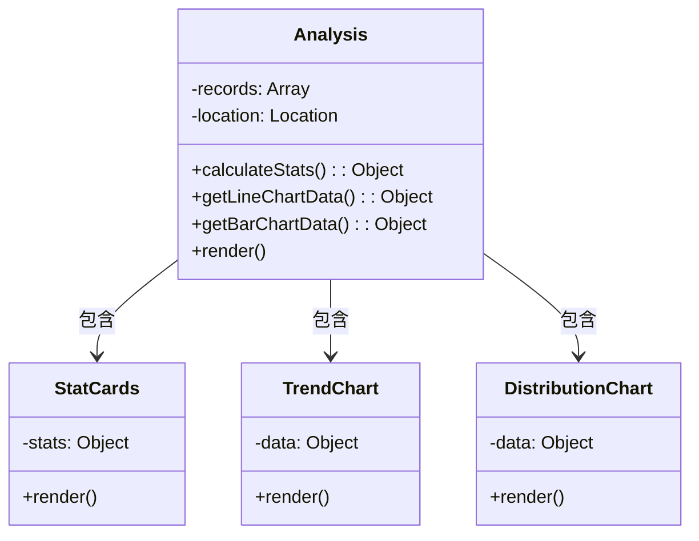

#### 2.4.2 统计计算流程图

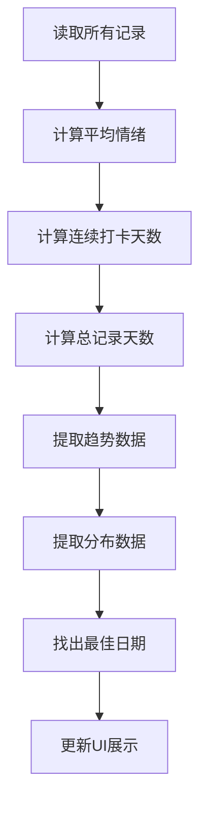

#### 2.4.3 连续打卡算法伪代码

```javascript
/**
 * 计算连续打卡天数
 * @param {Array} records - 记录数组
 * @returns {Number} - 连续天数
 */
function calculateStreak(records) {
    if (records.length === 0) return 0
    
    // 按日期排序（降序）
    const sorted = [...records].sort((a, b) => b.time - a.time)
    
    // 获取所有唯一日期
    const dates = [...new Set(sorted.map(r => r.date))].sort((a, b) => 
        new Date(b) - new Date(a)
    )
    
    if (dates.length === 0) return 0
    
    // 检查最新日期是否是今天或昨天
    const today = new Date()
    const yesterday = new Date(today)
    yesterday.setDate(yesterday.getDate() - 1)
    
    const latestDate = new Date(dates[0])
    
    // 如果最新记录不是今天或昨天，连续打卡中断
    const isRecent = (
        latestDate.toDateString() === today.toDateString() ||
        latestDate.toDateString() === yesterday.toDateString()
    )
    
    if (!isRecent) return 0
    
    // 计算连续天数
    let streak = 1
    for (let i = 0; i < dates.length - 1; i++) {
        const current = new Date(dates[i])
        const next = new Date(dates[i + 1])
        
        // 计算两天之间的差距（天数）
        const diffDays = Math.floor(
            (current.getTime() - next.getTime()) / (1000 * 60 * 60 * 24)
        )
        
        if (diffDays === 1) {
            streak++
        } else {
            break
        }
    }
    
    return streak
}
```

---

### 2.5 洞察模块 (Insight.jsx)

#### 2.5.1 组件类图

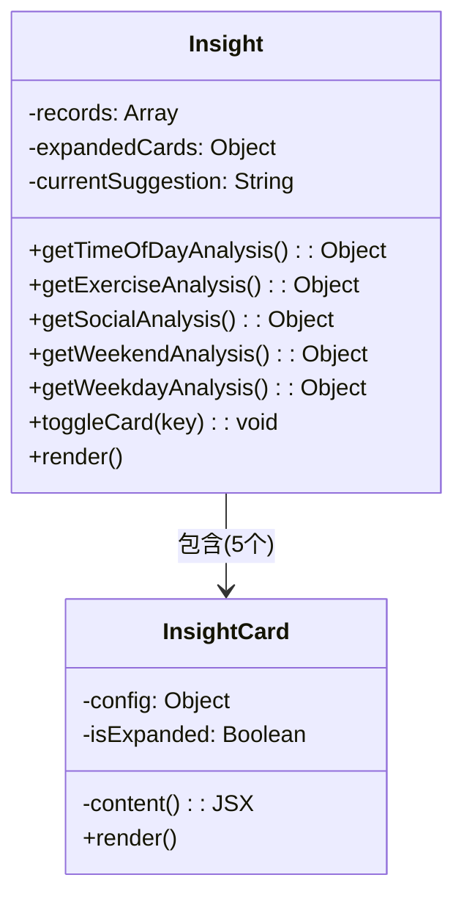

---

## 3. 关键算法设计

### 3.1 早晨能量算法

#### 3.1.1 算法流程图

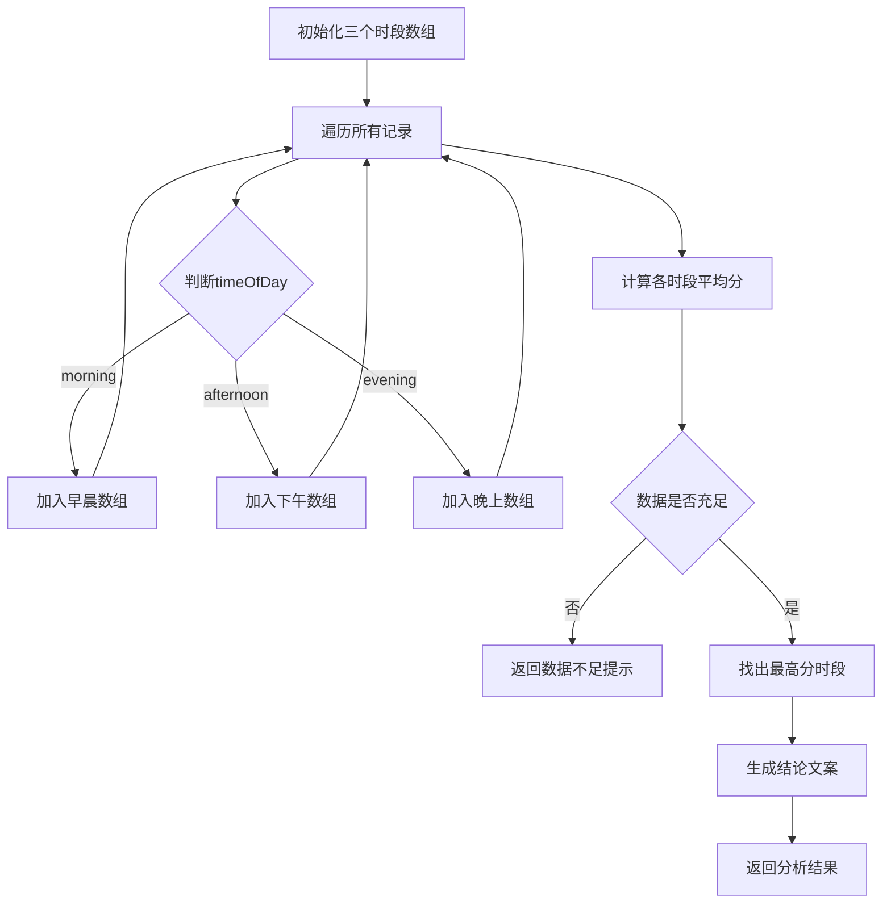

#### 3.1.2 完整伪代码

```javascript
/**
 * 时段情绪分析算法
 * @param {Array} records - 所有记录
 * @returns {Object} - 分析结果
 */
function getTimeOfDayAnalysis(records) {
    // 1. 初始化分组数组
    const morningRecords = []
    const afternoonRecords = []
    const eveningRecords = []
    
    // 2. 遍历记录分组
    records.forEach(record => {
        const moodValue = getMoodValue(record)
        
        if (record.timeOfDay === 'morning') {
            morningRecords.push(moodValue)
        } else if (record.timeOfDay === 'afternoon') {
            afternoonRecords.push(moodValue)
        } else if (record.timeOfDay === 'evening') {
            eveningRecords.push(moodValue)
        }
    })
    
    // 3. 计算平均分（至少2条记录才计算）
    const morningAvg = morningRecords.length >= 2 
        ? calculateAverage(morningRecords) 
        : null
    const afternoonAvg = afternoonRecords.length >= 2 
        ? calculateAverage(afternoonRecords) 
        : null
    const eveningAvg = eveningRecords.length >= 2 
        ? calculateAverage(eveningRecords) 
        : null
    
    // 4. 找出最高分时段
    let bestTime = null
    let bestValue = -1
    const times = [
        { key: 'morning', avg: morningAvg },
        { key: 'afternoon', avg: afternoonAvg },
        { key: 'evening', avg: eveningAvg },
    ]
    
    times.forEach(t => {
        if (t.avg !== null && t.avg > bestValue) {
            bestValue = t.avg
            bestTime = t.key
        }
    })
    
    // 5. 生成结论
    let conclusion = ''
    if (bestTime === 'morning') {
        conclusion = '你是早起活力型，早上状态最好！'
    } else if (bestTime === 'afternoon') {
        conclusion = '你是午后续航型，下午效率最高！'
    } else if (bestTime === 'evening') {
        conclusion = '你是夜猫子型，越晚越精神~'
    }
    
    // 6. 判断是否有足够数据
    const hasEnoughData = morningAvg !== null || afternoonAvg !== null || eveningAvg !== null
    
    return {
        morningAvg,
        afternoonAvg,
        eveningAvg,
        bestTime,
        conclusion,
        hasEnoughData,
        counts: {
            morning: morningRecords.length,
            afternoon: afternoonRecords.length,
            evening: eveningRecords.length
        }
    }
}

/**
 * 获取情绪分值
 * @param {Object} record - 记录对象
 * @returns {Number} - 分值(1-5)
 */
function getMoodValue(record) {
    // 优先取mood.value
    if (record.mood && typeof record.mood.value === 'number') {
        return record.mood.value
    }
    // 其次取strength
    if (typeof record.strength === 'number') {
        return record.strength
    }
    // 默认3分（中性）
    return 3
}

/**
 * 计算平均值，处理空数组
 * @param {Array} values - 数值数组
 * @returns {Number} - 平均值
 */
function calculateAverage(values) {
    if (values.length === 0) return null
    return values.reduce((sum, val) => sum + val, 0) / values.length
}
```

### 3.2 运动有益算法

#### 3.2.1 算法流程图

```mermaid
flowchart TD
    A[初始化两组数组] --> B[遍历所有记录]
    B --> C{hasExercise为true?}
    C -->|是| D[加入运动日数组]
    C -->|否| E[加入非运动日数组]
    D --> B
    E --> B
    B --> F{运动日是否有数据}
    F -->|否| G[返回"无运动记录"提示]
    F -->|是| H[计算两组平均分]
    H --> I[计算差值]
    I --> J{差值判断}
    J -->|>0.3| K[运动提升情绪]
    J -->|<-0.3| L[运动后情绪下降]
    J -->|其他| M[影响不大]
    K --> N[生成结论和建议]
    L --> N
    M --> N
    N --> O[返回分析结果]
```

#### 3.2.2 完整伪代码

```javascript
/**
 * 运动对情绪影响分析算法
 * @param {Array} records - 所有记录
 * @returns {Object} - 分析结果
 */
function getExerciseAnalysis(records) {
    // 1. 初始化分组数组
    const exerciseRecords = []
    const restRecords = []
    
    // 2. 遍历记录分组
    records.forEach(record => {
        const moodValue = getMoodValue(record)
        
        if (record.hasExercise) {
            exerciseRecords.push(moodValue)
        } else {
            restRecords.push(moodValue)
        }
    })
    
    // 3. 判断是否有运动数据
    const hasExerciseData = exerciseRecords.length > 0
    
    if (!hasExerciseData) {
        return {
            hasExerciseData: false,
            message: '标记几次运动日，就能看到运动对你的影响啦~'
        }
    }
    
    // 4. 计算平均分（至少1条记录）
    const exerciseAvg = exerciseRecords.length >= 1 
        ? calculateAverage(exerciseRecords) 
        : null
    const restAvg = restRecords.length >= 1 
        ? calculateAverage(restRecords) 
        : null
    
    // 5. 计算差值并生成结论
    let diffText = ''
    let suggestion = '坚持每周运动3次，心情会越来越好哦~'
    
    if (exerciseAvg !== null && restAvg !== null) {
        const diff = exerciseAvg - restAvg
        
        if (diff > 0.3) {
            diffText = `运动让你的情绪提升了 ${diff.toFixed(1)} 分！`
        } else if (diff < -0.3) {
            diffText = '运动后情绪反而低了？可能是太累了~'
            suggestion = '试试运动后好好休息，或者降低运动强度~'
        } else {
            diffText = '运动对你情绪影响不大，保持就好~'
        }
    }
    
    return {
        hasExerciseData: true,
        exerciseAvg,
        restAvg,
        exerciseCount: exerciseRecords.length,
        restCount: restRecords.length,
        diffText,
        suggestion
    }
}
```

### 3.3 社交提升算法

#### 3.3.1 算法流程图

```mermaid
flowchart TD
    A[初始化两组数组] --> B[遍历所有记录]
    B --> C{hasSocial为true?}
    C -->|是| D[加入社交日数组]
    C -->|否| E[加入独处日数组]
    D --> B
    E --> B
    B --> F{社交日是否有数据}
    F -->|否| G[返回"无社交记录"提示]
    F -->|是| H[计算两组平均分]
    H --> I[计算差值]
    I --> J{差值判断}
    J -->|>0.3| K[社交提升情绪]
    J -->|<-0.3| L[独处状态更好]
    J -->|其他| M[两者差不多]
    K --> N[生成结论和建议]
    L --> N
    M --> N
    N --> O[返回分析结果]
```

#### 3.3.2 完整伪代码

```javascript
/**
 * 社交对情绪影响分析算法
 * @param {Array} records - 所有记录
 * @returns {Object} - 分析结果
 */
function getSocialAnalysis(records) {
    // 1. 初始化分组数组
    const socialRecords = []
    const aloneRecords = []
    
    // 2. 遍历记录分组
    records.forEach(record => {
        const moodValue = getMoodValue(record)
        
        if (record.hasSocial) {
            socialRecords.push(moodValue)
        } else {
            aloneRecords.push(moodValue)
        }
    })
    
    // 3. 判断是否有社交数据
    const hasSocialData = socialRecords.length > 0
    
    if (!hasSocialData) {
        return {
            hasSocialData: false,
            message: '标记几次社交日，就能看到社交对你的影响啦~'
        }
    }
    
    // 4. 计算平均分（至少1条记录）
    const socialAvg = socialRecords.length >= 1 
        ? calculateAverage(socialRecords) 
        : null
    const aloneAvg = aloneRecords.length >= 1 
        ? calculateAverage(aloneRecords) 
        : null
    
    // 5. 计算差值并生成结论
    let diffText = ''
    let suggestion = ''
    
    if (socialAvg !== null && aloneAvg !== null) {
        const diff = socialAvg - aloneAvg
        
        if (diff > 0.3) {
            diffText = `社交让你的情绪提升了 ${diff.toFixed(1)} 分，多和朋友出去玩吧！`
            suggestion = '约上三五好友，让快乐翻倍~'
        } else if (diff < -0.3) {
            diffText = '你更喜欢独处，一个人时状态更好~'
            suggestion = '遵从内心，独处时也能收获满满的能量~'
        } else {
            diffText = '社交和独处对你都差不多，随心就好~'
            suggestion = '不管是社交还是独处，舒服最重要~'
        }
    }
    
    return {
        hasSocialData: true,
        socialAvg,
        aloneAvg,
        socialCount: socialRecords.length,
        aloneCount: aloneRecords.length,
        diffText,
        suggestion
    }
}
```

### 3.4 周末低落算法

#### 3.4.1 算法流程图

```mermaid
flowchart TD
    A[初始化两组数组] --> B[遍历所有记录]
    B --> C[获取日期的星期几]
    C --> D{是否周末?}
    D -->|是(0或6)| E[加入周末数组]
    D -->|否| F[加入工作日数组]
    E --> B
    F --> B
    B --> G[计算两组平均分]
    G --> H{数据是否充足}
    H -->|否| I[返回"数据不足"提示]
    H -->|是| J[计算差值]
    J --> K{差值判断}
    K -->|>0.5| L[标题:周末更嗨]
    K -->|<-0.5| M[标题:周末低落]
    K -->|其他| N[标题:情绪稳定]
    L --> O[生成结论文案]
    M --> O
    N --> O
    O --> P[返回分析结果]
```

#### 3.4.2 完整伪代码

```javascript
/**
 * 工作日vs周末情绪对比算法
 * @param {Array} records - 所有记录
 * @returns {Object} - 分析结果
 */
function getWeekendAnalysis(records) {
    // 1. 初始化分组数组
    const weekdayRecords = []
    const weekendRecords = []
    
    // 2. 遍历记录分组
    records.forEach(record => {
        const moodValue = getMoodValue(record)
        const date = new Date(record.time)
        const dayOfWeek = date.getDay() // 0=周日, 6=周六
        
        if (dayOfWeek === 0 || dayOfWeek === 6) {
            weekendRecords.push(moodValue)
        } else {
            weekdayRecords.push(moodValue)
        }
    })
    
    // 3. 计算平均分（至少2条记录才计算）
    const weekdayAvg = weekdayRecords.length >= 2 
        ? calculateAverage(weekdayRecords) 
        : null
    const weekendAvg = weekendRecords.length >= 2 
        ? calculateAverage(weekendRecords) 
        : null
    
    // 4. 判断数据是否充足
    const hasEnoughData = weekdayAvg !== null || weekendAvg !== null
    
    // 5. 根据差值确定标题和颜色
    let title = '情绪稳定'
    let color = 'bg-[#eff6ff]'
    let textColor = 'text-[#2563eb]'
    let tagBg = 'bg-[rgba(96,165,250,0.2)]'
    
    if (weekdayAvg !== null && weekendAvg !== null) {
        const diff = weekendAvg - weekdayAvg
        
        if (diff > 0.5) {
            title = '周末更嗨'
            color = 'bg-[#f0fdf4]'
            textColor = 'text-[#16a34a]'
            tagBg = 'bg-[rgba(74,222,128,0.2)]'
        } else if (diff < -0.5) {
            title = '周末低落'
            color = 'bg-[#fffbeb]'
            textColor = 'text-[#d97706]'
            tagBg = 'bg-[rgba(251,191,36,0.2)]'
        }
    }
    
    // 6. 生成结论
    let conclusion = ''
    const diff = weekdayAvg !== null && weekendAvg !== null ? (weekendAvg - weekdayAvg).toFixed(1) : null
    
    if (diff !== null) {
        if (parseFloat(diff) > 0.5) {
            conclusion = `你周末的情绪比工作日高 ${diff} 分，很会享受生活呀~`
        } else if (parseFloat(diff) < -0.5) {
            conclusion = '你工作日情绪更好，是个热爱工作的人！'
        } else {
            conclusion = '工作日和周末情绪差不多，状态很稳定~'
        }
    } else if (weekdayAvg === null) {
        conclusion = '工作日记录不足2条，还无法对比~'
    } else {
        conclusion = '周末记录不足2条，还无法对比~'
    }
    
    return {
        weekdayAvg,
        weekendAvg,
        weekdayCount: weekdayRecords.length,
        weekendCount: weekendRecords.length,
        title,
        color,
        textColor,
        tagBg,
        conclusion,
        hasEnoughData
    }
}
```

### 3.5 周中低谷算法

#### 3.5.1 算法流程图

```mermaid
flowchart TD
    A[初始化7天数组] --> B[遍历所有记录]
    B --> C[获取日期的星期几]
    C --> D[转换为0-6索引]
    D --> E[加入对应天数数组]
    E --> B
    B --> F[计算每天平均分]
    F --> G[找出最高/最低分]
    G --> H{是否有数据}
    H -->|否| I[返回"无数据"提示]
    H -->|是| J[生成柱状图数据]
    J --> K[生成总结文案]
    K --> L[返回分析结果]
```

#### 3.5.2 完整伪代码

```javascript
/**
 * 星期情绪分析算法
 * @param {Array} records - 所有记录
 * @returns {Object} - 分析结果
 */
function getWeekdayAnalysis(records) {
    // 1. 初始化7天数组 (周一到周日)
    const weekdayData = [[], [], [], [], [], [], []]
    
    // 2. 遍历记录分组
    records.forEach(record => {
        const moodValue = getMoodValue(record)
        const date = new Date(record.time)
        const day = date.getDay() // 0=周日, 1=周一
        
        // 转换为0-6索引（周一=0, 周日=6）
        const adjustedDay = day === 0 ? 6 : day - 1
        weekdayData[adjustedDay].push(moodValue)
    })
    
    // 3. 计算每天平均分
    const averages = weekdayData.map(dayRecords => {
        if (dayRecords.length === 0) return null
        return calculateAverage(dayRecords)
    })
    
    // 4. 找出最高和最低分的天数
    let maxDay = null
    let minDay = null
    let maxValue = -1
    let minValue = 6
    
    averages.forEach((avg, index) => {
        if (avg !== null) {
            if (avg > maxValue) {
                maxValue = avg
                maxDay = index
            }
            if (avg < minValue) {
                minValue = avg
                minDay = index
            }
        }
    })
    
    // 5. 判断是否有数据
    const hasData = averages.some(avg => avg !== null)
    
    return {
        averages,           // 每天平均分数组
        maxDay,             // 最高分天数索引
        minDay,             // 最低分天数索引
        maxValue,           // 最高分
        minValue,           // 最低分
        hasData,            // 是否有数据
        counts: weekdayData.map(d => d.length) // 每天记录数
    }
}
```

---

## 4. 数据结构设计

### 4.1 localStorage完整数据结构

#### 4.1.1 存储Key

```
moodRecords
```

#### 4.1.2 数组结构

```javascript
[
  {
    date: String,           // 日期字符串，格式: "2026/6/25"
    mood: {
      key: String,          // 情绪标识: "elated"|"good"|"neutral"|"low"|"rough"
      name: String,         // 中文名称: "开心"|"良好"|"平静"|"低落"|"糟糕"
      emoji: String,        // 表情符号: "😄"|"😊"|"😐"|"😔"|"😣"
      color: String,        // 主题色: "#22c55e"|"#84cc16"|"#f59e0b"|"#3b82f6"|"#ef4444"
      bgColor: String,      // 背景色: "#dcfce7"|"#f0fdf4"|"#fffbeb"|"#eff6ff"|"#fef2f2"
      textColor: String     // 文字色: "#166534"|"#4d7c0f"|"#92400e"|"#1e40af"|"#991b1b"
    },
    strength: Number,       // 分值: 1-5
    note: String,           // 用户备注（可选）
    time: Number,           // Unix时间戳（毫秒）
    timeOfDay: String,      // 时段: "morning"|"afternoon"|"evening"（可选）
    hasExercise: Boolean,   // 是否运动（可选）
    hasSocial: Boolean      // 是否社交（可选）
  }
]
```

#### 4.1.3 字段约束

| 字段 | 类型 | 必填 | 约束 | 默认值 |
|------|------|------|------|--------|
| date | String | 是 | toLocaleDateString()格式 | - |
| mood.key | String | 是 | 5种情绪之一 | - |
| mood.name | String | 是 | 中文名称 | - |
| mood.emoji | String | 是 | 表情符号 | - |
| mood.color | String | 是 | 十六进制颜色 | - |
| mood.bgColor | String | 是 | 十六进制颜色 | - |
| mood.textColor | String | 是 | 十六进制颜色 | - |
| strength | Number | 是 | 1-5整数 | - |
| note | String | 否 | 任意文本 | "" |
| time | Number | 是 | Unix时间戳 | - |
| timeOfDay | String | 否 | morning/afternoon/evening | undefined |
| hasExercise | Boolean | 否 | true/false | false |
| hasSocial | Boolean | 否 | true/false | false |

### 4.2 向后兼容性处理

由于新增字段（timeOfDay、hasExercise、hasSocial）是在后期添加的，需要处理旧数据的兼容性：

```javascript
/**
 * 获取情绪分值（兼容新旧数据）
 * @param {Object} record - 记录对象
 * @returns {Number} - 分值
 */
function getMoodValue(record) {
    // 优先取mood.value（新数据格式）
    if (record.mood && typeof record.mood.value === 'number') {
        return record.mood.value
    }
    // 其次取strength（兼容旧数据）
    if (typeof record.strength === 'number') {
        return record.strength
    }
    // 默认3分
    return 3
}

/**
 * 获取时段（兼容旧数据）
 * @param {Object} record - 记录对象
 * @returns {String|null} - 时段或null
 */
function getTimeOfDay(record) {
    if (record.timeOfDay) return record.timeOfDay
    
    // 从时间戳推断（旧数据兼容）
    const hour = new Date(record.time).getHours()
    if (hour >= 6 && hour < 12) return 'morning'
    if (hour >= 12 && hour < 18) return 'afternoon'
    return 'evening'
}

/**
 * 获取运动标记（兼容旧数据）
 * @param {Object} record - 记录对象
 * @returns {Boolean}
 */
function getHasExercise(record) {
    return record.hasExercise || false
}

/**
 * 获取社交标记（兼容旧数据）
 * @param {Object} record - 记录对象
 * @returns {Boolean}
 */
function getHasSocial(record) {
    return record.hasSocial || false
}
```

---

## 5. 接口详细说明

### 5.1 组件间接口

#### 5.1.1 页面路由接口

| 路由 | 组件 | 描述 | 传递参数 |
|------|------|------|----------|
| / | Record | 情绪记录页面 | 无 |
| /calendar | Calendar | 日历页面 | 无 |
| /analysis | Analysis | 数据分析页面 | 无 |
| /insight | Insight | 情绪洞察页面 | 无 |

#### 5.1.2 数据存取接口

```javascript
// 数据存取工具函数

/**
 * 读取所有情绪记录
 * @returns {Array} - 记录数组，空数组时返回[]
 */
export function readMoodRecords() {
    try {
        const data = localStorage.getItem('moodRecords')
        return data ? JSON.parse(data) : []
    } catch (error) {
        console.error('读取情绪记录失败:', error)
        return []
    }
}

/**
 * 保存单条情绪记录
 * @param {Object} record - 记录对象
 * @returns {Boolean} - 是否保存成功
 */
export function saveMoodRecord(record) {
    try {
        const records = readMoodRecords()
        records.push(record)
        localStorage.setItem('moodRecords', JSON.stringify(records))
        return true
    } catch (error) {
        console.error('保存情绪记录失败:', error)
        return false
    }
}

/**
 * 清空所有情绪记录
 * @returns {Boolean} - 是否清空成功
 */
export function clearMoodRecords() {
    try {
        localStorage.removeItem('moodRecords')
        return true
    } catch (error) {
        console.error('清空情绪记录失败:', error)
        return false
    }
}
```

### 5.2 图表接口

#### 5.2.1 趋势面积图配置

```javascript
const lineChartConfig = {
    type: 'line',
    data: {
        labels: Array<String>,        // 日期数组
        datasets: Array<Object>       // 数据集
    },
    options: {
        responsive: true,
        maintainAspectRatio: false,
        plugins: {
            legend: {
                display: true,
                position: 'bottom'
            },
            tooltip: {
                backgroundColor: 'rgba(255,255,255,0.95)',
                titleColor: '#1f2937',
                bodyColor: '#6b7280',
                borderColor: '#e5e7eb',
                borderWidth: 1,
                padding: 12,
                displayColors: true
            }
        },
        scales: {
            x: {
                grid: {
                    display: false
                },
                ticks: {
                    color: '#9ca3af',
                    font: {
                        size: 10
                    }
                }
            },
            y: {
                min: 0,
                max: 6,
                grid: {
                    color: '#f3f4f6'
                },
                ticks: {
                    color: '#9ca3af',
                    font: {
                        size: 10
                    },
                    stepSize: 1
                }
            }
        },
        interaction: {
            intersect: false,
            mode: 'index'
        },
        elements: {
            line: {
                tension: 0.4
            },
            point: {
                radius: 4,
                hoverRadius: 6
            }
        }
    }
}
```

#### 5.2.2 情绪分布柱状图配置

```javascript
const barChartConfig = {
    type: 'bar',
    data: {
        labels: ['开心', '良好', '平静', '低落', '糟糕'],
        datasets: [{
            label: '出现次数',
            data: Array<Number>,        // 各情绪出现次数
            backgroundColor: [
                'rgba(34, 197, 94, 0.7)',
                'rgba(132, 204, 22, 0.7)',
                'rgba(245, 158, 11, 0.7)',
                'rgba(59, 130, 246, 0.7)',
                'rgba(239, 68, 68, 0.7)'
            ],
            borderColor: [
                '#22c55e',
                '#84cc16',
                '#f59e0b',
                '#3b82f6',
                '#ef4444'
            ],
            borderWidth: 1,
            borderRadius: 8
        }]
    },
    options: {
        responsive: true,
        maintainAspectRatio: false,
        plugins: {
            legend: {
                display: false
            },
            tooltip: {
                backgroundColor: 'rgba(255,255,255,0.95)',
                titleColor: '#1f2937',
                bodyColor: '#6b7280',
                borderColor: '#e5e7eb',
                borderWidth: 1,
                padding: 12
            }
        },
        scales: {
            x: {
                grid: {
                    display: false
                },
                ticks: {
                    color: '#9ca3af',
                    font: {
                        size: 11
                    }
                }
            },
            y: {
                beginAtZero: true,
                grid: {
                    color: '#f3f4f6'
                },
                ticks: {
                    color: '#9ca3af',
                    font: {
                        size: 10
                    },
                    stepSize: 1
                }
            }
        }
    }
}
```

---

## 6. 异常处理设计

### 6.1 数据读取异常处理

```javascript
/**
 * 安全读取localStorage数据
 * @param {String} key - 存储键
 * @param {Any} defaultValue - 默认值
 * @returns {Any} - 解析后的数据
 */
function safeReadStorage(key, defaultValue = []) {
    try {
        const data = localStorage.getItem(key)
        if (!data) return defaultValue
        
        const parsed = JSON.parse(data)
        
        // 验证数据类型
        if (!Array.isArray(parsed)) {
            console.warn(`数据格式异常: ${key} 不是数组`)
            return defaultValue
        }
        
        // 验证每条记录的基本结构
        const validRecords = parsed.filter(record => {
            const isValid = record && 
                typeof record.date === 'string' &&
                record.mood && 
                typeof record.mood.key === 'string' &&
                typeof record.strength === 'number'
            
            if (!isValid) {
                console.warn('发现无效记录:', record)
            }
            return isValid
        })
        
        return validRecords
        
    } catch (error) {
        console.error(`读取存储失败 [${key}]:`, error)
        return defaultValue
    }
}
```

### 6.2 数据保存异常处理

```javascript
/**
 * 安全保存数据到localStorage
 * @param {String} key - 存储键
 * @param {Any} data - 要保存的数据
 * @returns {Boolean} - 是否成功
 */
function safeSaveStorage(key, data) {
    try {
        // 检查数据大小（localStorage限制约5MB）
        const jsonString = JSON.stringify(data)
        const sizeInBytes = new Blob([jsonString]).size
        
        if (sizeInBytes > 4 * 1024 * 1024) {
            console.warn('数据过大，可能无法保存')
        }
        
        localStorage.setItem(key, jsonString)
        return true
        
    } catch (error) {
        console.error(`保存数据失败 [${key}]:`, error)
        
        // 尝试清理旧数据后重试
        try {
            localStorage.removeItem(key)
            localStorage.setItem(key, JSON.stringify(data.slice(-100)))
            console.warn('已保留最近100条记录')
            return true
        } catch (retryError) {
            console.error('重试保存失败:', retryError)
            return false
        }
    }
}
```

### 6.3 日期解析异常处理

```javascript
/**
 * 安全解析日期
 * @param {String} dateStr - 日期字符串
 * @returns {Date|null} - Date对象或null
 */
function safeParseDate(dateStr) {
    if (!dateStr || typeof dateStr !== 'string') {
        return null
    }
    
    try {
        const date = new Date(dateStr)
        
        // 验证日期有效性
        if (isNaN(date.getTime())) {
            console.warn('无效日期:', dateStr)
            return null
        }
        
        return date
        
    } catch (error) {
        console.error('解析日期失败:', dateStr, error)
        return null
    }
}
```

### 6.4 图表渲染异常处理

```javascript
/**
 * 安全渲染图表
 * @param {Object} chartConfig - 图表配置
 * @param {String} canvasId - canvas元素ID
 * @returns {Chart|null} - Chart实例或null
 */
function safeRenderChart(chartConfig, canvasId) {
    try {
        const ctx = document.getElementById(canvasId)
        if (!ctx) {
            console.warn('未找到图表容器:', canvasId)
            return null
        }
        
        // 检查数据是否有效
        if (!chartConfig.data || !chartConfig.data.labels || chartConfig.data.labels.length === 0) {
            console.warn('图表数据为空')
            return null
        }
        
        return new Chart(ctx, chartConfig)
        
    } catch (error) {
        console.error('渲染图表失败:', canvasId, error)
        return null
    }
}
```

---

## 7. 附录

### 附录A：情绪配置常量

```javascript
const MOOD_CONFIG = {
    elated: {
        key: 'elated',
        name: '开心',
        emoji: '😄',
        value: 5,
        color: '#22c55e',
        bgColor: '#dcfce7',
        textColor: '#166534'
    },
    good: {
        key: 'good',
        name: '良好',
        emoji: '😊',
        value: 4,
        color: '#84cc16',
        bgColor: '#f0fdf4',
        textColor: '#4d7c0f'
    },
    neutral: {
        key: 'neutral',
        name: '平静',
        emoji: '😐',
        value: 3,
        color: '#f59e0b',
        bgColor: '#fffbeb',
        textColor: '#92400e'
    },
    low: {
        key: 'low',
        name: '低落',
        emoji: '😔',
        value: 2,
        color: '#3b82f6',
        bgColor: '#eff6ff',
        textColor: '#1e40af'
    },
    rough: {
        key: 'rough',
        name: '糟糕',
        emoji: '😣',
        value: 1,
        color: '#ef4444',
        bgColor: '#fef2f2',
        textColor: '#991b1b'
    }
}

const MOOD_KEYS = ['elated', 'good', 'neutral', 'low', 'rough']

const TIME_OF_DAY_CONFIG = {
    morning: { name: '早晨', emoji: '🌅' },
    afternoon: { name: '下午', emoji: '☀️' },
    evening: { name: '晚上', emoji: '🌙' }
}
```

### 附录B：颜色常量

```javascript
const COLORS = {
    // 页面主题色
    page: {
        log: '#4ade80',
        calendar: '#60a5fa',
        analysis: '#a78bfa',
        insight: '#fbbf24'
    },
    
    // 页面背景色
    pageBg: {
        log: '#f0fdf4',
        calendar: '#eff6ff',
        analysis: '#f5f3ff',
        insight: '#fffbeb'
    },
    
    // 通用颜色
    bg: '#f8fafc',
    cardBg: 'rgba(255, 255, 255, 0.85)',
    textPrimary: '#1f2937',
    textSecondary: '#6b7280',
    textTertiary: '#9ca3af'
}
```

### 附录C：文件结构

```
mood-viz/
├── src/
│   ├── main.jsx                    # 入口文件
│   ├── App.jsx                     # 全局布局组件
│   │   ├── Header                  # 顶部标题栏
│   │   └── BottomNav               # 底部导航栏
│   ├── index.css                   # 全局样式
│   │   ├── @theme                  # Tailwind主题配置
│   │   ├── @layer utilities        # 工具类
│   │   └── 全局样式规则
│   └── pages/
│       ├── Record.jsx              # 情绪记录页面
│       │   ├── MoodSelector        # 情绪选择器
│       │   ├── NoteInput           # 备注输入
│       │   ├── TagSelector         # 标签选择器
│       │   ├── SaveButton          # 保存按钮
│       │   └── RecentStreak        # 最近记录
│       ├── Calendar.jsx            # 日历页面
│       │   ├── MonthSwitcher       # 月份切换
│       │   ├── DayGrid             # 日期网格
│       │   ├── MoodLegend          # 情绪图例
│       │   └── DayDetailModal      # 详情弹窗
│       ├── Analysis.jsx            # 分析页面
│       │   ├── StatCards           # 数据卡片
│       │   ├── TrendChart          # 趋势图
│       │   ├── DistributionChart   # 分布图
│       │   └── BestDayCard         # 最佳日期
│       └── Insight.jsx             # 洞察页面
│           ├── QuickTips           # 小贴士
│           ├── InsightCards        # 洞察卡片
│           ├── MoodInsights        # 情绪小洞察
│           └── SuggestionSection   # 建议区
├── docs/
│   ├── MoodBloom概要设计说明书.md
│   └── MoodBloom详细设计说明书.md
└── package.json
```

---

**文档编制**: MoodBloom开发团队  
**审核**: _____________  
**批准**: _____________  
**日期**: 2026年6月28日  

---

_本规格说明书版权归MoodBloom项目组所有_
